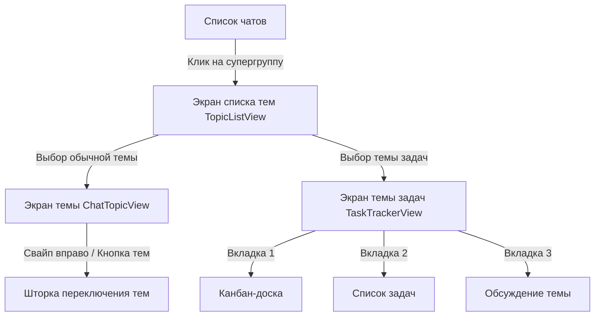

# VisorLink Mobile Client — Спецификация интеграции Тем (Форумов) и Трекера Задач (Topics & Kanban Tasks)

Документация для разработчиков мобильных клиентов **VisorLink** (**iOS / SwiftUI**, **Android / Jetpack Compose**, **Flutter / React Native**) по интеграции режима **Темы (Форумы в стиле Telegram)** и встроенного **Трекера задач (Канбан-доска)**.

---

## 1. Общая концепция и UX архитектура

В VisorLink супергруппы могут работать в двух режимах:
1. **Классический чат** (`isForum == false` или отсутствует): единый поток сообщений.
2. **Форум с темами** (`isForum == true`): группа разделена на независимые подтемы (Topics), аналогично супергруппам с темами в Telegram, с поддержкой встроенных задач и канбан-досок.

### 1.1. Типы тем (Topic Types)
- `chat` — стандартный чат подтемы с вложенными сообщениями, медиа, реакциями и голосовыми.
- `tasks` — специализированная тема с трекером задач (Канбан-доска, структурированный список задач с дедлайнами/приоритетами/исполнителями) и встроенной веткой обсуждения.

### 1.2. Главная тема («#Общий» / General) и обратная совместимость
- Каждая форум-группа обязательно содержит главную тему с флагом `isGeneral: true` (по умолчанию создается с заголовком «Общий чат» и эмодзи `💬`).
- **Правило обратной совместимости (Legacy Messages):** Сообщения, отправленные до включения режима форума (у которых поле `topicId` отсутствует, `null` или равно `'general'`), отображаются **исключительно в главной теме**.

---

## 2. Схема данных Firestore

### 2.1. Пути к коллекциям

| Назначение | Путь в Firestore | Описание |
|---|---|---|
| **Документ чата** | `/chats/{chatId}` | Метаданные группы, флаг `isForum` |
| **Участники группы** | `/chats/{chatId}/members/{userId}` | Роли (`owner`, `admin`, `member`), статус блокировок |
| **Список тем** | `/chats/{chatId}/topics/{topicId}` | Подколлекция тем группы |
| **Задачи темы** | `/chats/{chatId}/topics/{topicId}/tasks/{taskId}` | Подколлекция задач (для тем `type == "tasks"`) |
| **Сообщения чата** | `/chats/{chatId}/messages/{messageId}` | Единая коллекция всех сообщений группы |

---

### 2.2. Модель темы (`Topic`)

Путь: `/chats/{chatId}/topics/{topicId}`

```json
{
  "id": "topic_abc123",
  "title": "Дизайн и UI/UX",
  "icon": "🎨",
  "color": "#35C7E8",
  "type": "chat",
  "isGeneral": false,
  "isClosed": false,
  "createdBy": "user_uid_123",
  "createdAt": "Timestamp",
  "lastMessage": {
    "text": "Обновили макеты экрана профиля",
    "senderId": "user_uid_456",
    "senderUsername": "alex_design"
  },
  "lastMessageAt": "Timestamp",
  "unreadCount": 0
}
```

#### Описание полей `Topic`:
| Поле | Тип | Описание |
|---|---|---|
| `id` | `String` | Уникальный ID темы (ID документа) |
| `title` | `String` | Название темы (макс. 64 символа) |
| `icon` | `String` | Одиночный эмодзи (по умолчанию `💬` для чата, `📋` для задач) |
| `color` | `String` (HEX) | Акцентный цвет оформления (напр. `#35C7E8`, `#8C6BFF`) |
| `type` | `String` | `'chat'` или `'tasks'` |
| `isGeneral` | `Boolean` | `true`, если это главная тема группы (всегда закреплена вверху) |
| `isClosed` | `Boolean` | `true`, если тема закрыта для отправки новых сообщений обычными участниками |
| `createdBy` | `String` | UID создателя темы |
| `createdAt` | `Timestamp` | Дата создания |
| `lastMessage` | `Object \| String` | Превью последнего сообщения для отображения в списке тем |
| `lastMessageAt`| `Timestamp` | Время последнего сообщения (для сортировки списка) |
| `unreadCount` | `Number` | Количество непрочитанных сообщений для текущего пользователя |

---

### 2.3. Модель задачи (`TaskItem`)

Путь: `/chats/{chatId}/topics/{topicId}/tasks/{taskId}`

```json
{
  "id": "task_xyz789",
  "title": "Сверстать экран списка тем на iOS",
  "description": "Сделать плавную анимацию перехода и поддержку темной темы Biolume",
  "status": "in_progress",
  "priority": "high",
  "assigneeId": "user_uid_456",
  "assigneeName": "Алексей Смирнов",
  "assigneeAvatar": "https://cdn.visorlink.org/avatar_123.webp",
  "dueDate": "2026-09-05",
  "createdBy": "user_uid_123",
  "createdByName": "Иван Руководитель",
  "createdAt": "Timestamp",
  "updatedAt": "Timestamp"
}
```

#### Статусы задачи (`status`):
- `todo` — К выполнению (📥)
- `in_progress` — В работе (⚡)
- `review` — На проверке (👀)
- `done` — Завершено (✅)

#### Приоритеты задачи (`priority`):
- `low` — Низкий (🟢, `#A8DB6E`)
- `medium` — Средний (🟡, `#FFC24E`)
- `high` — Высокий (🔴, `#FF8A48`)
- `urgent` — Срочный (🔥, `#FF4D6A`)

---

### 2.4. Сообщения с привязкой к темам (`Message`)

Путь: `/chats/{chatId}/messages/{messageId}`

Все сообщения группы продолжают жить в **единой подколлекции `/messages`**. При отправке сообщения в тему добавляется поле `topicId`:

```json
{
  "senderId": "user_uid_123",
  "senderUsername": "ipos",
  "text": "Привет всем в новой теме!",
  "type": "text",
  "topicId": "topic_abc123",
  "createdAt": "Timestamp"
}
```

> [!IMPORTANT]
> **Оптимизация Firestore подписок на мобильных клиентах:**
> Не используйте составной запрос `where("topicId", "==", activeTopicId).orderBy("createdAt", "desc")` без создания составного индекса.
> **Рекомендуемый подход:** Мобильный клиент подписывается на сообщения чата с `orderBy("createdAt", "desc").limit(50)` и выполняет фильтрацию по активной теме в памяти приложения (`ViewModel` / `Store`).
> Для темы `isGeneral == true` фильтр сообщений:
> `message.topicId == null || message.topicId == activeTopic.id || message.topicId == "general"`

---

## 3. Разрешение профилей участников (Name, Username, Avatar)

В Firestore подколлекция `/chats/{chatId}/members/{userId}` содержит **только статус прав и модерации**:
```json
{
  "role": "admin", // "owner" | "admin" | "member"
  "joinedAt": "Timestamp",
  "banned": false,
  "muted": false,
  "mediaRestricted": false
}
```

> [!CAUTION]
> **Запрещено выводить пользователю сырой `userId` (UID) вместо имени!**
> Мобильный клиент обязан резолвить информацию о пользователе:
> 1. Сначала проверить кеш `chat.participantData[userId]` (если передан в документе чата).
> 2. Если данных нет — запросить документ `/users/{userId}` и сохранить в локальный LRU-кеш (`UserProfileCache`).

Структура документа `/users/{userId}`:
```json
{
  "displayName": "Алексей Смирнов",
  "username": "alex_smirnov",
  "avatarUrl": "https://cdn.visorlink.org/avatar.webp"
}
```

---

## 4. Правила безопасности Firestore (`firestore.rules`)

Правила для тем и задач уже развернуты на сервере:

```javascript
match /chats/{chatId} {
  // Темы
  match /topics/{topicId} {
    allow read: if isFullyVerified() && (isMember(chatId) || isPublicChannel(chatId));
    allow create: if isFullyVerified() && isMember(chatId) && notBanned(chatId) && notMuted(chatId);
    allow update: if isFullyVerified() && isMember(chatId) && notBanned(chatId);
    allow delete: if isFullyVerified() && (isAdmin(chatId) || resource.data.createdBy == request.auth.uid);

    // Задачи внутри тем
    match /tasks/{taskId} {
      allow read: if isFullyVerified() && isMember(chatId) && notBanned(chatId);
      allow create: if isFullyVerified() && isMember(chatId) && notBanned(chatId) && notMuted(chatId);
      allow update: if isFullyVerified() && isMember(chatId) && notBanned(chatId) && notMuted(chatId);
      allow delete: if isFullyVerified() && isMember(chatId) && notBanned(chatId) && (isAdmin(chatId) || resource.data.createdBy == request.auth.uid);
    }
  }
}
```

---

## 5. Мобильный UX и экраны

### 5.1. Навигация в группе с темами


### 5.2. Главный экран списка тем (`TopicListView`)
- **Header:** Аватар группы, название группы (без лишних бейджей), кнопка создания темы `(+)` и настройки группы `(⚙️)`.
- **Search & Filter Bar:**
  - Поле поиска по названию тем с лупой и кнопкой быстрой очистки `(✕)`.
  - Сегментированный переключатель: «Все», «💬 Чаты», «📋 Задачи».
- **Список тем:**
  - Закрепленная тема `#Общий` всегда на первой позиции.
  - Карточка темы: иконка (40x40 с мягким свечением цвета темы), название (с приоритетом ширины), компактное время (`сейчас`, `5м`, `14:20`, `вчера`), превью последнего сообщения и бейдж непрочитанных.

### 5.3. Экран трекера задач (`TaskTrackerView`)
- **Top Bar:** Кнопка «Все темы», бейдж темы, мини-прогрессбар выполнения задач (`3/10 выполнено (30%)`), кнопка «+ Задача».
- **Вкладки переключения (Segmented Control):**
  - `📋 Канбан-доска`
  - `📄 Список задач`
  - `💬 Обсуждение`
- **Канбан:** 4 горизонтальные колонки («К выполнению», «В работе», «На проверке», «Готово»).
  - Свайп карточки влево/вправо для быстрой смены статуса.
  - Клик по карточке — открытие модального окна просмотра/редактирования.

---

## 6. Пример реализации: iOS (Swift & SwiftUI)

### 6.1. Модели данных (Swift)

```swift
import Foundation
import FirebaseFirestore

public enum TopicType: String, Codable {
    case chat
    case tasks
}

public struct Topic: Identifiable, Codable {
    @DocumentID public var id: String?
    public var title: String
    public var icon: String?
    public var color: String?
    public var type: TopicType
    public var isGeneral: Bool?
    public var isClosed: Bool?
    public var createdBy: String?
    public var createdAt: Date?
    public var lastMessage: LastMessagePreview?
    public var lastMessageAt: Date?
    public var unreadCount: Int?

    public var displayIcon: String { icon ?? (type == .tasks ? "📋" : "💬") }
    public var displayColor: String { color ?? (type == .tasks ? "#8C6BFF" : "#35C7E8") }
}

public struct LastMessagePreview: Codable {
    public var text: String?
    public var senderUsername: String?
}

public enum TaskStatus: String, Codable, CaseIterable {
    case todo = "todo"
    case inProgress = "in_progress"
    case review = "review"
    case done = "done"

    public var title: String {
        switch self {
        case .todo: return "К выполнению"
        case .inProgress: return "В работе"
        case .review: return "На проверке"
        case .done: return "Готово"
        }
    }
}

public enum TaskPriority: String, Codable, CaseIterable {
    case low, medium, high, urgent

    public var icon: String {
        switch self {
        case .low: return "🟢"
        case .medium: return "🟡"
        case .high: return "🔴"
        case .urgent: return "🔥"
        }
    }
}

public struct TaskItem: Identifiable, Codable {
    @DocumentID public var id: String?
    public var title: String
    public var description: String?
    public var status: TaskStatus
    public var priority: TaskPriority
    public var assigneeId: String?
    public var assigneeName: String?
    public var assigneeAvatar: String?
    public var dueDate: String?
    public var createdBy: String?
    public var createdByName: String?
    public var createdAt: Date?
    public var updatedAt: Date?
}
```

### 6.2. Репозиторий подписки на темы (Swift / Combine)

```swift
import FirebaseFirestore
import Combine

public final class TopicsRepository: ObservableObject {
    @Published public var topics: [Topic] = []
    @Published public var isLoading = false
    
    private let db = Firestore.firestore()
    private var listener: ListenerRegistration?

    public func subscribeToTopics(chatId: String) {
        isLoading = true
        listener?.remove()
        
        let query = db.collection("chats").document(chatId).collection("topics")
            .order(by: "lastMessageAt", descending: true)
        
        listener = query.addSnapshotListener { [weak self] snapshot, error in
            guard let self = self else { return }
            self.isLoading = false
            guard let documents = snapshot?.documents else { return }
            
            var list = documents.compactMap { try? $0.data(as: Topic.self) }
            
            // Закрепляем тему "Общий" на самом верху
            list.sort { (t1, t2) -> Bool in
                if t1.isGeneral == true { return true }
                if t2.isGeneral == true { return false }
                let d1 = t1.lastMessageAt ?? t1.createdAt ?? Date.distantPast
                let d2 = t2.lastMessageAt ?? t2.createdAt ?? Date.distantPast
                return d1 > d2
            }
            
            DispatchQueue.main.async {
                self.topics = list
            }
        }
    }

    public func unsubscribe() {
        listener?.remove()
        listener = nil
    }
}
```

---

## 7. Пример реализации: Android (Kotlin & Jetpack Compose)

### 7.1. Data классы (Kotlin)

```kotlin
package org.visorlink.models

import com.google.firebase.Timestamp
import com.google.firebase.firestore.DocumentId

data class Topic(
    @DocumentId val id: String = "",
    val title: String = "",
    val icon: String? = null,
    val color: String? = null,
    val type: String = "chat", // "chat" | "tasks"
    val isGeneral: Boolean = false,
    val isClosed: Boolean = false,
    val createdBy: String = "",
    val createdAt: Timestamp? = null,
    val lastMessageAt: Timestamp? = null,
    val lastMessage: Map<String, Any>? = null,
    val unreadCount: Int = 0
) {
    val displayIcon: String get() = icon ?: if (type == "tasks") "📋" else "💬"
    val isTasks: Boolean get() = type == "tasks"
}

data class TaskItem(
    @DocumentId val id: String = "",
    val title: String = "",
    val description: String = "",
    val status: String = "todo", // "todo", "in_progress", "review", "done"
    val priority: String = "medium", // "low", "medium", "high", "urgent"
    val assigneeId: String? = null,
    val assigneeName: String? = null,
    val assigneeAvatar: String? = null,
    val dueDate: String? = null,
    val createdBy: String = "",
    val createdByName: String = "",
    val createdAt: Timestamp? = null,
    val updatedAt: Timestamp? = null
)
```

### 7.2. ViewModel с фильтрацией сообщений по теме (Kotlin / Flow)

```kotlin
package org.visorlink.viewmodel

import androidx.lifecycle.ViewModel
import androidx.lifecycle.viewModelScope
import com.google.firebase.firestore.FirebaseFirestore
import com.google.firebase.firestore.Query
import kotlinx.coroutines.flow.MutableStateFlow
import kotlinx.coroutines.flow.StateFlow
import kotlinx.coroutines.flow.asStateFlow
import kotlinx.coroutines.launch
import org.visorlink.models.Message
import org.visorlink.models.Topic

class ForumChatViewModel : ViewModel() {
    private val db = FirebaseFirestore.getInstance()

    private val _messages = MutableStateFlow<List<Message>>(emptyList())
    val messages: StateFlow<List<Message>> = _messages.asStateFlow()

    private var allChatMessages = listOf<Message>()
    private var currentTopic: Topic? = null

    fun selectTopic(chatId: String, topic: Topic) {
        currentTopic = topic
        applyTopicFilter()
    }

    fun startListeningMessages(chatId: String) {
        db.collection("chats").document(chatId).collection("messages")
            .orderBy("createdAt", Query.Direction.DESCENDING)
            .limit(100)
            .addSnapshotListener { snapshot, _ ->
                if (snapshot != null) {
                    allChatMessages = snapshot.toObjects(Message::class.java)
                    applyTopicFilter()
                }
            }
    }

    private fun applyTopicFilter() {
        val topic = currentTopic ?: return
        val isGeneral = topic.isGeneral || topic.id == "general"

        _messages.value = allChatMessages.filter { msg ->
            if (isGeneral) {
                msg.topicId.isNullOrEmpty() || msg.topicId == topic.id || msg.topicId == "general"
            } else {
                msg.topicId == topic.id
            }
        }
    }
}
```

---

## 8. Чек-лист проверки мобильной интеграции (Definition of Done)

- [ ] **Определение режима форума:** При открытии группы проверяется `chat.isForum == true`. Если включен — открывается экран тем (`TopicListView`).
- [ ] **Главная тема `#Общий`:** Закреплена в самом верху списка тем. В ней отображаются как новые сообщения с `topicId == activeTopic.id`, так и старые сообщения без `topicId`.
- [ ] **Имена вместо UID:** Нигде в интерфейсе (карточки задач, выпадающие списки участников, настройки группы) не отображаются сырые `uid`. Все резолвятся в `displayName` + `avatarUrl`.
- [ ] **Трекер задач:**
  - Переключение представлений: «Канбан», «Список», «Обсуждение».
  - Смена статуса задачи обновляет поле `status` в `/chats/{chatId}/topics/{topicId}/tasks/{taskId}`.
  - Вкладка «Обсуждение» открывает чат темы с возможностью отправлять сообщения с текущим `topicId`.
- [ ] **Поиск и фильтры:** Поиск по темам и задачам фильтрует элементы налету без задержек и артефактов интерфейса.
- [ ] **Тестирование прав:** Забаненные/замьюченные участники не могут создавать темы и задачи (ошибка прав `PERMISSION_DENIED` обрабатывается дружелюбным Toast/Alert).
