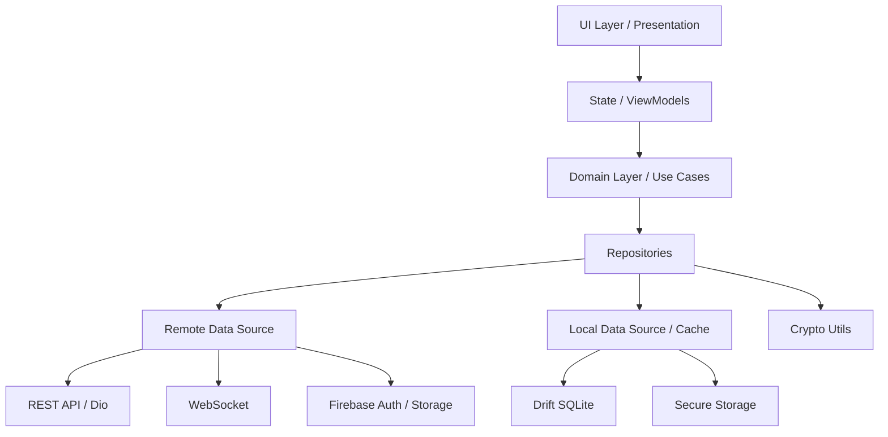
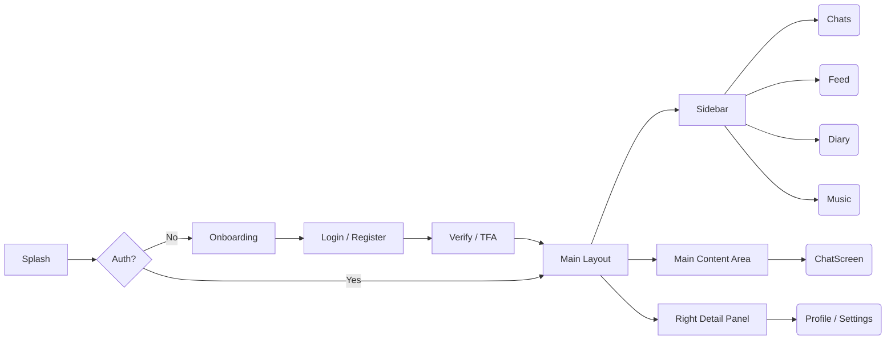
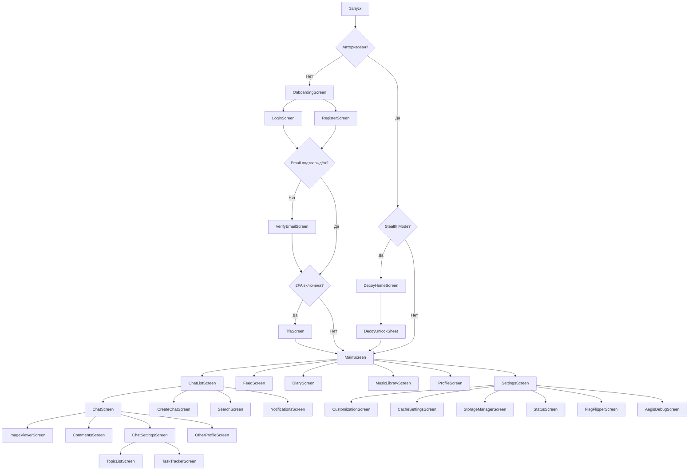

# Функциональная спецификация VisorLink Desktop

## 1. Введение и обзор продукта

**VisorLink** — это защищённый многофункциональный мессенджер нового поколения. Платформа поддерживает личные и групповые чаты, каналы, голосовые сообщения, встроенное медиа-хранилище, персональный зашифрованный дневник, продвинутый режим маскировки (Stealth mode) и встроенного ассистента Aegis. Приложение распространяется через собственный сервис обновлений, минуя ограничения классических магазинов приложений.

Данный документ представляет собой **исчерпывающую функциональную спецификацию** для разработки Desktop-клиента VisorLink с использованием фреймворка Flutter. В документе описаны все архитектурные решения, экраны, API-взаимодействия и специфичные для настольных операционных систем (Windows, macOS, Linux) адаптации.

---

## 2. Архитектура и стек технологий

Desktop-клиент строится на базе современного стека Flutter с упором на производительность, безопасность и поддержку офлайн-режима.

### 2.1 Рекомендуемый стек технологий (Flutter)

*   **Фреймворк:** Flutter (Dart) с поддержкой Windows, macOS и Linux.
*   **Управление состоянием (State Management):** Riverpod (или BLoC в качестве альтернативы) для обеспечения UDF (Unidirectional Data Flow).
*   **Внедрение зависимостей (Dependency Injection):** Riverpod или `get_it`.
*   **Маршрутизация (Navigation):** `go_router` для поддержки вложенной навигации и глубоких ссылок (deep links).
*   **Сетевое взаимодействие (HTTP):** `dio` для REST API, с поддержкой перехватчиков (interceptors) для токенов и логирования.
*   **WebSocket:** `web_socket_channel` для реального времени (индикация набора текста, статусы присутствия, новые сообщения).
*   **Локальная база данных (Offline-first):** `drift` (через SQLite FFI) для высокопроизводительного кэширования.
*   **Безопасное хранилище:** `flutter_secure_storage` для хранения токенов и ключей шифрования (MasterKey).
*   **Push-уведомления:** `ntfy` (вместо FCM, который используется на Android). Endpoint: `POST /users/me/ntfy-topic`.
*   **Медиа и аудио:** `just_audio` (воспроизведение), `record` (запись голоса), `cached_network_image` (кэширование изображений).
*   **Криптография:** `pointycastle` (AES-GCM-256, PBKDF2WithHmacSHA256) для шифрования дневников и режима маскировки (аналог CryptoUtils из Android).
*   **Системная интеграция (Desktop):** `bitsdojo_window` или `window_manager` для кастомных заголовков окна, `tray_manager` для системного трея, `hotkey_manager` для глобальных горячих клавиш.

### 2.2 Архитектура приложения

Архитектура следует принципам Clean Architecture и MVVM/UDF.



#### Слои:
1.  **data/**: модели, удаленные источники (remote), репозитории (repositories), интеграция с Aegis.
2.  **di/**: настройка внедрения зависимостей.
3.  **ui/**: экраны (screens), компоненты (components), навигация (navigation), темы (theme).
4.  **utils/**: криптография, утилиты форматов, константы.

#### Dual Backend и Offline-first
*   **Firebase**: используется для аутентификации (Auth), хранения тяжелых файлов (Storage).
*   **REST API**: `https://backend.visorlink.org` — основной бекенд для бизнес-логики.
*   **WebSocket**: `wss://backend.visorlink.org/ws` — для real-time событий.
*   **Offline-first**: все данные сначала пишутся/читаются из локальной БД (`drift`). При отсутствии сети действия помещаются в `OutboxManager` (очередь гарантированной доставки) и отправляются при появлении подключения.

---

## 3. Модели данных

Все модели должны быть реализованы в виде иммутабельных классов (например, с использованием `freezed` и `json_serializable`).

### 3.1 UserProfile (Профиль пользователя)

```dart
@freezed
class UserProfile with _$UserProfile {
  const factory UserProfile({
    required String uid,
    required String email,
    required String username,
    required String displayName,
    required String bio,
    String? avatarUrl,
    required bool online,
    int? lastSeen,
    required List<String> fcmTokens,
    required bool isAdmin,
    required bool isBot,
    required int bits,
    required int streak,
    int? proUntil,
    required bool tfaEnabled,
    required bool ignoreCustomizations,
    Map<String, double>? interestWeights,
    String? tgUsername,
    required bool diaryEnabled,
    required List<String> stickerPackIds,
    required List<String> ntfyTopics,
    required List<String> mutedChatIds,
    int? acceptedAt,
    String? acceptedVersion,
    required List<String> blockedUserIds,
  }) = _UserProfile;
}
```

### 3.2 Chat (Чат)

```dart
enum ChatType { direct, group, channel }

@freezed
class Chat with _$Chat {
  const factory Chat({
    required String id,
    required ChatType type,
    required List<String> participants,
    String? name,
    required bool isForum,
    required ChatSettings settings,
    required int unreadCount,
    Message? lastMessage,
  }) = _Chat;
}
```

### 3.3 Member (Участник)

```dart
@freezed
class Member with _$Member {
  const factory Member({
    required String role, // "owner", "admin", "member"
    required bool muted,
    required bool mediaRestricted,
    required bool banned,
  }) = _Member;
}
```

### 3.4 Message (Сообщение)
Типы сообщений: `text`, `image`, `voice`, `sticker`, `album`, `gift`, `file`.

---

## 4. Навигация и экраны (Полный инвентарь)

Для Desktop-версии навигация строится по принципу многопанельного интерфейса (Master-Detail). Главный экран содержит боковую панель (Sidebar), которая заменяет Bottom Navigation из мобильной версии.



### 4.1 Авторизация и Онбординг (Auth & Onboarding)

1.  **OnboardingScreen**
    *   **Описание:** Вводный слайдер, демонстрирующий возможности приложения (сообщения, приватность, дневник и т.д.).
    *   **Desktop специфика:** Широкие иллюстрации с текстом сбоку, управление стрелками клавиатуры.

2.  **LoginScreen**
    *   **Описание:** Форма входа по email и паролю.
    *   **API / Логика:** Валидация email, вызов Firebase Auth `signInWithEmailAndPassword`.

3.  **RegisterScreen**
    *   **Описание:** Создание аккаунта. Поля: email, пароль, username, display name.
    *   **API / Логика:** Вызов Firebase Auth `createUserWithEmailAndPassword`, затем `POST /users/sync` для синхронизации с основным бекендом.

4.  **VerifyEmailScreen**
    *   **Описание:** Экран ожидания подтверждения почты.
    *   **Логика:** Периодический опрос (polling) статуса авторизации. Кнопка повторной отправки письма с таймером (cooldown).

5.  **TfaScreen**
    *   **Описание:** Ввод кода двухфакторной аутентификации.
    *   **API / Логика:** 6-значный ввод, вызов `POST /auth/2fa/verify`. Отображение обратного отсчета срока действия кода.

### 4.2 Главный поток (Main Flow)

**MainScreen** — базовый Scaffold для Desktop. Включает левый Sidebar (вместо VlNavigationBar) и плавающий мини-плеер (AudioPlaybackDockBar). Sidebar переключает 4 основные вкладки в зависимости от Feature Flags.

6.  **ChatListScreen** (Вкладка 1: Чаты, всегда активна)
    *   **Описание:** Основной вид. Список всех чатов (direct, group, channel), отсортированный по `lastMessageAt`.
    *   **UI элементы:** Аватар, имя/username, превью последнего сообщения, бейдж непрочитанных, индикатор онлайна, индикатор набора текста. Строка поиска сверху. FAB (или кнопка в шапке) для создания чата.
    *   **Логика:** Поддержка оффлайн-режима (баннер "Нет сети"). Использование кэша SQLite.

7.  **FeedScreen** (Вкладка 2: Discover, при `discoverEnabled == true`)
    *   **Описание:** Лента публичных каналов и постов.
    *   **API / UI:** Вызов `GET /feed`. Карточный интерфейс (текст, изображения, лайки). Кнопка лайка, переход в канал по клику.

8.  **DiaryScreen** (Вкладка 3: Diary, при `diaryEnabled == true`)
    *   **Описание:** Персональный зашифрованный дневник. Редактор Markdown.
    *   **Логика:** AES-GCM шифрование записей локально. Ежедневные напоминания (на Desktop — локальное системное уведомление в 21:00).

9.  **MusicLibraryScreen** (Вкладка 4: Music, при `musicEnabled == true`)
    *   **Описание:** Встроенный музыкальный плеер и библиотека. Плейлисты, треки.
    *   **Интеграция:** Подключение к Google Drive для медиа-хранилища.

### 4.3 Чаты и Сообщения (Chat & Messaging)

10. **ChatScreen**
    *   **Описание:** Ядро интерфейса обмена сообщениями.
    *   **Пагинация:** Cursor-based (`GET /chats/{chatId}/messages`, limit=50, before=msgId).
    *   **Ввод:** Текстовое поле, кнопка отправки, прикрепление (изображение, файл, стикер), кнопка записи голоса. *Desktop: отправка по Enter, перенос строки по Shift+Enter. Вставка изображений из буфера обмена (Ctrl+V), Drag-and-drop файлов.*
    *   **Голосовые сообщения:** Визуализация волновой формы (waveform).
    *   **Действия с сообщениями:** Ответ (Reply), Редактирование (до 30 минут), Удаление, Пересылка (Forward), Реакции (выбор эмодзи). *Desktop: Контекстное меню по правому клику, реакции при наведении.*
    *   **WebSocket:** Отправка и прием `type=typing/stop_typing`.
    *   **Прочтение:** `PUT /chats/{chatId}/messages/{msgId}/read`.
    *   **Особенности:** Упоминания (@username), поддержка топиков для форумов (параметр `topicId`), спойлеры (скрытый текст), подарки (тип `premium_box`).
    *   **Шапка:** Индикатор статуса онлайн, переход в профиль/настройки чата.
    *   **FAB:** Прокрутка в самый низ.

11. **ImageViewerScreen**
    *   **Описание:** Полноэкранный просмотр медиа.
    *   **Desktop:** Зум колесиком мыши, перелистывание стрелками. Кнопки "Сохранить как...", "Поделиться".

12. **CommentsScreen**
    *   **Описание:** Просмотр комментариев к сообщению в канале (треды).
    *   **UI:** Оригинальное сообщение зафиксировано сверху, список комментариев ниже. Поле ввода идентично ChatScreen.

13. **SavedMessagesScreen**
    *   **Описание:** Персональное "облачное хранилище" (чат с самим собой).
    *   **UI:** Как ChatScreen, но без индикаторов онлайна и набора текста других пользователей.

### 4.4 Группы, Каналы и Продуктивность

14. **CreateChatScreen**
    *   **Описание:** Создание чатов.
    *   **Типы:**
        *   Direct: выбор пользователя.
        *   Group: название, выбор нескольких участников.
        *   Channel: название, тег, описание, аватар, режим форума.
    *   **API:** `POST /chats/create`.

15. **ChatSettingsScreen**
    *   **Описание:** Управление группой/каналом.
    *   **Функции:**
        *   Редактирование профиля (название, аватар, тег).
        *   Тумблеры: `joinByLink`, `joinByTag`, `allowReactions`, `allowComments`, `noForwards`, `botAllowed`.
        *   Список участников и управление ролями (owner/admin/member).
        *   Модерация: мут, бан, кик.
        *   Управление ссылками-приглашениями.
        *   Управление ключами ботов (`create`/`delete`).
        *   Покинуть/удалить чат.

16. **NotificationsScreen**
    *   **Описание:** Лента активности (упоминания, инвайты, система).
    *   **API:** `GET /notifications`.

17. **TopicListScreen**
    *   **Описание:** Список топиков для чатов с включенным режимом форума. Каждый топик открывает отдельный тред (как ChatScreen с `topicId`).

18. **TaskTrackerScreen**
    *   **Описание:** Встроенный Kanban-трекер задач, привязанный к чату/топику.
    *   **Desktop:** Drag-and-drop карточек задач мышью между колонками.

### 4.5 Профиль и Настройки (Profile & Settings)

19. **ProfileScreen**
    *   **Описание:** Профиль текущего пользователя.
    *   **UI:** Аватар, display name, username, bio (редактируемые). Счетчик стрика, баланс bits, статус PRO (`proUntil`), статус интеграции с Telegram. Кнопка выхода.
    *   **API:** `PUT /users/me/profile`, `PUT /users/me/username`.

20. **OtherProfileScreen**
    *   **Описание:** Профиль другого пользователя.
    *   **Действия:** "Отправить сообщение", "Заблокировать". Отображение статуса онлайн.

21. **SettingsScreen**
    *   **Описание:** Главный хаб настроек.
    *   **Разделы:** Внешний вид (Темы: M3E/Biolume/Forge), Уведомления, 2FA, Режим маскировки (Stealth mode - установка PIN), Язык, Управление кэшем, Управление хранилищем, About/Legal (через `GET /internal/{key}`).

22. **CustomizationScreen**
    *   **Описание:** Настройки темы. Выбор M3E / Biolume Neumorphism / Forge Industrial. Переключатель Light/Dark, выбор акцентного цвета (через `withSignalAccent`).

23. **CacheSettingsScreen**
    *   **Описание:** Управление локальной БД. Очистка кэша чатов, сообщений, профилей.

24. **StorageManagerScreen**
    *   **Описание:** Аналитика занятого места медиафайлами. Диаграммы использования по категориям (изображения, голос, видео). Выборочная очистка.

25. **FlagFlipperScreen**
    *   **Описание:** Экран разработчика для управления Feature Flags.
    *   **API:** `GET /feature-flags`.

26. **AegisDebugScreen**
    *   **Описание:** Отладка ассистента Aegis. Поле для ввода текста, просмотр ответа движка.

### 4.6 Статус системы (Status)

27. **StatusScreen**
    *   **Описание:** Отображение состояния серверов.
    *   **API / UI:** `GET /health`, `GET /incidents`. График аптайма за 24 часа. Кнопка `POST /incidents/report`.

### 4.7 Режим маскировки (Stealth / Decoy Mode)

*Desktop-специфика режима маскировки крайне важна для безопасности.*

28. **DecoyHomeScreen**
    *   **Описание:** Фейковый безобидный экран (например, калькулятор, системные утилиты или RSS-читалка), который отображается при блокировке приложения.
    *   **Desktop:** Заголовок окна (Window Title) меняется на "Calculator" или "Notes". Иконка в трее заменяется на нейтральную. Приложение убирается из панели задач и остается только в трее.

29. **DecoyNewsScreen**
    *   **Описание:** Интерфейс чтения фейковых новостей.

30. **DecoyTotpScreen**
    *   **Описание:** Приложение-аутентификатор (TOTP), служащее экраном ввода секретного PIN-кода для разблокировки.

31. **DecoyUnlockSheet / Dialog**
    *   **Описание:** Скрытое окно для ввода PIN-кода. Валидация хэша (PBKDF2-hashed). Глобальный хоткей (например, `Ctrl+Shift+L`) моментально блокирует приложение.

### 4.8 Поиск (Search)

32. **SearchScreen**
    *   **Описание:** Глобальный поиск по юзерам, сообщениям, каналам.
    *   **API:** `GET /users?q=...` + поиск по локальной SQLite.
    *   **Desktop:** Вызов по `Ctrl+F`.

---

## 5. Сетевой слой и интеграция с Backend

Полная спецификация API находится в [`visorlink_api_contract.md`](file:///c:/Users/IposDev/StudioProjects/VisorLinkMobileAndroid/docs/visorlink_api_contract.md). Ниже — привязка эндпоинтов к экранам и функциональности десктоп-клиента.

### 5.1 Аутентификация

Все защищённые эндпоинты используют **Firebase Authentication**. Токен передаётся в заголовке:

```
Authorization: Bearer <Firebase_ID_Token>
```

Для десктопа рекомендуется использовать пакет `firebase_auth` (Flutter) или REST API Firebase Auth (`https://identitytoolkit.googleapis.com/v1/`). Токен обновляется автоматически; при `401` — принудительный refresh или переход на `LoginScreen`.

### 5.2 Users API (привязка к экранам)

| Эндпоинт | Метод | Экран | Описание |
|---|---|---|---|
| `/users/me` | GET | ProfileScreen, MainScreen | Получить профиль текущего пользователя |
| `/users/sync` | POST | RegisterScreen | Синхронизация после Firebase Auth sign-up |
| `/users/{uid}` | GET | OtherProfileScreen | Профиль другого пользователя |
| `/users/me/profile` | PUT | ProfileScreen, SettingsScreen | Обновить профиль (displayName, bio, avatar, tfaEnabled) |
| `/users/me/username` | PUT | ProfileScreen | Изменить username |
| `/users/check-username/{username}` | GET | RegisterScreen, ProfileScreen | Проверить доступность username |
| `/users/me/fcm-token` | POST | — | Не используется на Desktop (заменён на ntfy) |
| `/users/me/ntfy-topic` | POST | SettingsScreen (автоматически) | Регистрация ntfy-топика для десктоп-уведомлений |
| `/users/me/streak` | POST | ProfileScreen | Ежедневный стрик и бонусные bits |
| `/users/me/buy-pro` | POST | SettingsScreen | Покупка PRO / Trial |
| `/users` | GET | SearchScreen | Поиск пользователей (?q=query) |
| `/users/search` | GET | SearchScreen | Алиас поиска |

### 5.3 2FA API

| Эндпоинт | Метод | Экран | Описание |
|---|---|---|---|
| `/auth/2fa/request` | POST | TfaScreen | Запросить 6-значный код на email |
| `/auth/2fa/verify` | POST | TfaScreen | Верифицировать код |

### 5.4 Chats API

| Эндпоинт | Метод | Экран | Описание |
|---|---|---|---|
| `/chats` | GET | ChatListScreen | Список чатов пользователя |
| `/chats/create` | POST | CreateChatScreen | Создать чат (direct/group/channel) |
| `/chats/direct` | POST | OtherProfileScreen | Создать direct-чат |
| `/chats/find-by-tag/{tag}` | GET | SearchScreen | Найти канал по тегу |
| `/chats/join/invite` | POST | DeepLink handler | Присоединиться по инвайт-коду |
| `/chats/join/tag` | POST | FeedScreen | Присоединиться по тегу |
| `/chats/{chatId}` | GET | ChatScreen | Получить детали чата |
| `/chats/{chatId}/settings` | PUT | ChatSettingsScreen | Обновить настройки (права admin/owner) |
| `/chats/{chatId}/leave` | POST | ChatSettingsScreen | Покинуть чат |
| `/chats/{chatId}` | DELETE | ChatSettingsScreen | Удалить чат (только owner) |
| `/chats/{chatId}/members` | GET | ChatSettingsScreen | Список участников |
| `/chats/{chatId}/moderate` | POST | ChatSettingsScreen | Мут/бан/кик участника |
| `/chats/{chatId}/members/{uid}/role` | PUT | ChatSettingsScreen | Изменить роль (admin/member) |
| `/chats/{chatId}/invite-link/regenerate` | POST | ChatSettingsScreen | Перегенерировать ссылку |
| `/chats/{chatId}/invite-user` | POST | ChatSettingsScreen | Пригласить по username/UID |
| `/chats/{chatId}/allow-bot` | POST | ChatSettingsScreen | Разрешить ботов |
| `/chats/{chatId}/bot-keys` | GET/POST | ChatSettingsScreen | Ключи канальных ботов |
| `/chats/{chatId}/bot-keys/{keyId}` | DELETE | ChatSettingsScreen | Удалить ключ |
| `/chats/{chatId}/bot-keys/{keyId}/regenerate` | POST | ChatSettingsScreen | Перегенерировать ключ |

### 5.5 Messages API

| Эндпоинт | Метод | Экран | Описание |
|---|---|---|---|
| `/chats/{chatId}/messages` | GET | ChatScreen | Сообщения с cursor-пагинацией (?limit=50&before=msgId) |
| `/chats/{chatId}/messages` | POST | ChatScreen | Отправить сообщение |
| `/messages/send` | POST | ChatScreen | Альтернативный эндпоинт (chatId в теле) |
| `/chats/{chatId}/messages/album` | POST | ChatScreen | Отправить альбом (несколько изображений) |
| `/chats/{chatId}/messages/{msgId}` | PUT | ChatScreen | Редактировать (до 30 мин после отправки) |
| `/chats/{chatId}/messages/{msgId}` | DELETE | ChatScreen | Удалить сообщение |
| `/chats/{chatId}/messages/{msgId}/reactions` | PUT | ChatScreen | Toggle реакции (emoji) |
| `/chats/{chatId}/messages/{msgId}/read` | PUT | ChatScreen | Пометить прочитанным |
| `/chats/{chatId}/messages/{msgId}/redeem-gift` | POST | ChatScreen | Активировать подарок |
| `/chats/{chatId}/messages/{msgId}/comments` | GET | CommentsScreen | Получить комментарии |
| `/chats/{chatId}/messages/{msgId}/comments` | POST | CommentsScreen | Добавить комментарий |

### 5.6 Gifts & Stickers API

| Эндпоинт | Метод | Экран | Описание |
|---|---|---|---|
| `/gifts/send` | POST | ChatScreen | Отправить подарок (premium_box) |
| `/gifts/{messageId}/redeem` | POST | ChatScreen | Активировать подарок |
| `/stickers/my` | GET | ChatScreen (стикер-пикер) | Мои стикерпаки |
| `/sticker-packs` | GET | ChatScreen | Алиас |
| `/sticker-packs` | POST | — | Создать стикерпак |
| `/sticker-packs/{packId}/install` | POST | ChatScreen | Установить стикерпак |
| `/sticker-packs/{packId}` | DELETE | SettingsScreen | Удалить стикерпак |

### 5.7 Invites, Notifications, Feed API

| Эндпоинт | Метод | Экран | Описание |
|---|---|---|---|
| `/invites` | GET | NotificationsScreen | Список приглашений |
| `/invites/{id}/respond` | POST | NotificationsScreen | Принять/отклонить приглашение |
| `/notifications` | GET | NotificationsScreen | Список уведомлений |
| `/feed` | GET | FeedScreen | Лента рекомендаций (?limit=30) |
| `/feed/{id}/like` | POST | FeedScreen | Toggle лайка |
| `/feed/{id}/toggle-comments` | POST | FeedScreen | Вкл/выкл комментарии (автор) |

### 5.8 Bots API

| Эндпоинт | Метод | Экран | Описание |
|---|---|---|---|
| `/bots/dm` | GET | SettingsScreen | Список DM-ботов |
| `/bots/dm` | POST | SettingsScreen | Создать DM-бота |
| `/bots/dm/allow` | POST | ChatSettingsScreen | Разрешить бота в чате |
| `/bots/dm/{botUid}` | PUT | SettingsScreen | Редактировать бота |
| `/bots/dm/{botUid}` | DELETE | SettingsScreen | Удалить бота |
| `/bots/dm/{botUid}/regenerate-token` | POST | SettingsScreen | Перегенерировать токен |
| `/webhooks/dm-bot` | POST | — (внешний вызов) | Webhook DM-бота |
| `/webhooks/channel-bot` | POST | — (внешний вызов) | Webhook канального бота |

### 5.9 Telegram, Incidents, Feature Flags, Admin

| Эндпоинт | Метод | Экран | Описание |
|---|---|---|---|
| `/telegram/generate-code` | POST | SettingsScreen | Генерация кода привязки TG |
| `/telegram/unbind` | POST/DELETE | SettingsScreen | Отвязать Telegram |
| `/incidents` | GET | StatusScreen | Список инцидентов (публичный) |
| `/incidents/report` | POST | StatusScreen | Отправить репорт |
| `/incidents/{id}/resolve` | POST | StatusScreen (admin) | Разрешить инцидент |
| `/feature-flags` | GET | FlagFlipperScreen, инициализация | Получить все фиче-флаги |
| `/health` | GET | StatusScreen | Health check бэкенда |
| `/internal/{key}` | GET | SettingsScreen (Legal) | Юридические документы (tos, privacy) |
| `/admin/*` | * | AdminPanel (если isAdmin) | Все админские операции |

### 5.10 WebSocket протокол

**Подключение:**
```
wss://backend.visorlink.org/ws?token=<Firebase_ID_Token>
```

**Конфигурация:** Ping Period: 15 сек, Timeout: 30 сек, Max Frame: 10 MB.

#### Действия клиента → сервер

```dart
// Подписка на канал чата
{'type': 'subscribe', 'channel': 'chat:$chatId'}

// Отписка
{'type': 'unsubscribe', 'channel': 'chat:$chatId'}

// Индикатор набора
{'type': 'typing', 'chatId': chatId}

// Прекратить набор
{'type': 'stop_typing', 'chatId': chatId}

// Поддержание соединения
{'type': 'ping'}
```

#### События сервер → клиент

| Тип события | Канал | Payload | Описание |
|---|---|---|---|
| `message_new` | `chat:<chatId>` | MessageDto (JSON-строка) | Новое сообщение |
| `message_update` | `chat:<chatId>` | MessageDto (JSON-строка) | Обновление (реакции, редактирование) |
| `message_delete` | `chat:<chatId>` | `{id, chatId}` | Удаление |
| `chat_update` | `chat:<chatId>` | ChatDto (JSON-строка) | Обновление параметров чата |
| `typing` | `chat:<chatId>` | `{chatId, uid, username, isTyping}` | Индикатор набора |
| `presence` | `user:<uid>` | `{uid, isOnline, lastSeenAt}` | Онлайн-статус |
| `notification` | `user:<uid>` | Payload уведомления | Персональное уведомление |
| `pong` | `system` | `"pong"` | Ответ на ping |
| `error` | `<channel>` | `"Forbidden subscription"` | Ошибка подписки |

#### Реализация WebSocket-клиента на Dart

```dart
import 'dart:convert';
import 'package:web_socket_channel/web_socket_channel.dart';

class VisorLinkWebSocket {
  WebSocketChannel? _channel;
  final _eventController = StreamController<WsEvent>.broadcast();

  Stream<WsEvent> get events => _eventController.stream;

  void connect(String firebaseToken) {
    _channel = WebSocketChannel.connect(
      Uri.parse('wss://backend.visorlink.org/ws?token=$firebaseToken'),
    );

    _channel!.stream.listen(
      (raw) {
        final json = jsonDecode(raw as String) as Map<String, dynamic>;
        final event = WsEvent(
          type: json['type'] as String,
          channel: json['channel'] as String?,
          data: json['data'] as String?,
        );
        _eventController.add(event);
      },
      onError: (e) => _scheduleReconnect(),
      onDone: () => _scheduleReconnect(),
    );

    // Периодический ping каждые 15 сек
    Timer.periodic(const Duration(seconds: 15), (_) {
      _channel?.sink.add(jsonEncode({'type': 'ping'}));
    });
  }

  void subscribe(String channel) {
    _channel?.sink.add(jsonEncode({
      'type': 'subscribe',
      'channel': channel,
    }));
  }

  void sendTyping(String chatId) {
    _channel?.sink.add(jsonEncode({
      'type': 'typing',
      'chatId': chatId,
    }));
  }

  void stopTyping(String chatId) {
    _channel?.sink.add(jsonEncode({
      'type': 'stop_typing',
      'chatId': chatId,
    }));
  }

  void dispose() {
    _channel?.sink.close();
    _eventController.close();
  }
}
```

---

## 6. Модели данных (DTO Reference)

Все модели должны быть иммутабельными. Рекомендуемый подход: `freezed` + `json_serializable` для автогенерации `fromJson`/`toJson`.

### 6.1 UserDto

| Поле | Тип | Nullable | Описание |
|---|---|---|---|
| `id` / `uid` | String | ❌ | Firebase UID |
| `username` | String | ❌ | Уникальное имя пользователя |
| `displayName` | String | ❌ | Отображаемое имя |
| `email` | String | ❌ | Email |
| `bio` | String | ❌ | Биография |
| `avatarUrl` | String | ✅ | URL аватара |
| `isOnline` | bool | ❌ | Статус онлайн |
| `lastSeenAt` | int? | ✅ | Epoch ms последнего визита |
| `createdAt` | int | ❌ | Epoch ms создания |
| `bits` | int | ❌ | Баланс битов |
| `streak` | int | ❌ | Счётчик стрика |
| `showStreak` | bool | ❌ | Показывать стрик другим |
| `trialUsed` | bool | ❌ | Пробный период использован |
| `isAdmin` | bool | ❌ | Системный администратор |
| `isBot` | bool | ❌ | Учётная запись бота |
| `botBadge` | String? | ✅ | `"official"` / `"verified"` / `"unverified"` |
| `tfaEnabled` | bool | ❌ | 2FA включена |
| `proUntil` | int? | ✅ | PRO подписка до (epoch ms) |
| `customization` | Map? | ✅ | Произвольный JSON кастомизации |

### 6.2 ChatDto

| Поле | Тип | Nullable | Описание |
|---|---|---|---|
| `id` | String | ❌ | ID чата |
| `type` | String | ❌ | `"direct"` / `"group"` / `"channel"` |
| `name` | String? | ✅ | Название чата/канала |
| `tag` | String? | ✅ | Уникальный тег канала |
| `description` | String? | ✅ | Описание |
| `avatarUrl` | String? | ✅ | URL аватара чата |
| `participants` / `memberIds` | List\<String\> | ❌ | UID участников |
| `participantData` | Map\<String, ParticipantDataDto\> | ❌ | Данные участников |
| `lastMessage` | LastMessageDto? | ✅ | Последнее сообщение |
| `lastMessageAt` | int? | ✅ | Epoch ms последнего сообщения |
| `memberCount` | int | ❌ | Количество участников |
| `badge` | String? | ✅ | `"official"` / `"verified"` |
| `botAllowed` | bool | ❌ | Боты разрешены |
| `joinByLink` | bool | ❌ | Вход по ссылке |
| `joinByTag` | bool | ❌ | Вход по тегу |
| `allowReactions` | bool | ❌ | Реакции разрешены |
| `allowComments` | bool | ❌ | Комментарии разрешены |
| `isForum` | bool | ❌ | Режим форума |
| `noForwards` | bool | ❌ | Запрет пересылки |
| `inviteLink` | String? | ✅ | Код приглашения |
| `createdAt` | int | ❌ | Epoch ms создания |

### 6.3 MessageDto

| Поле | Тип | Nullable | Описание |
|---|---|---|---|
| `id` | String | ❌ | ID сообщения |
| `chatId` | String | ❌ | ID чата |
| `senderId` | String | ❌ | UID отправителя |
| `senderUsername` | String | ❌ | Username отправителя |
| `type` | String | ❌ | `"text"` / `"image"` / `"voice"` / `"sticker"` / `"album"` / `"gift"` / `"file"` |
| `text` | String? | ✅ | Текст сообщения |
| `caption` | String? | ✅ | Подпись к медиа |
| `url` | String? | ✅ | URL медиафайла |
| `fileName` | String? | ✅ | Имя файла |
| `duration` | int? | ✅ | Длительность аудио/видео (сек) |
| `stickerId` | String? | ✅ | ID стикера |
| `cdnMediaId` | String? | ✅ | ID медиа в CDN |
| `images` | List\<AlbumImageDto\> | ❌ | Изображения альбома |
| `replyTo` | ReplyDto? | ✅ | Цитируемое сообщение |
| `forwardFrom` | ForwardDto? | ✅ | Пересланное от |
| `reactions` | List\<ReactionDto\> | ❌ | Реакции |
| `readBy` | List\<String\> | ❌ | Прочитано (UID) |
| `spoiler` | bool | ❌ | Спойлер |
| `isBot` | bool | ❌ | Отправлено ботом |
| `botLabel` / `botBadge` | String? | ✅ | Бейдж бота |
| `commentsCount` | int | ❌ | Количество комментариев |
| `commentsEnabled` | bool | ❌ | Комментарии включены |
| `giftType` | String? | ✅ | `"premium_box"` для подарков |
| `redeemed` | bool | ❌ | Подарок активирован |
| `topicId` | String? | ✅ | ID топика (для форумов) |
| `deleted` | bool | ❌ | Удалено |
| `lastEdited` | int? | ✅ | Epoch ms последнего редактирования |
| `createdAt` | int | ❌ | Epoch ms создания |

### 6.4 Вспомогательные DTO

**ReplyDto:** `{id, type, text, url, senderUsername}`

**ForwardDto:** `{senderId, senderUsername, chatId}`

**ReactionDto:** `{emoji, uids: List<String>, count}`

**AlbumImageDto:** `{cdnMediaId, url, fileName, spoiler}`

**LastMessageDto:** `{id, senderId, senderUsername, type, text, timestamp}`

**ParticipantDataDto:** `{username, displayName, avatarUrl}`

**ChatMemberDto:** `{chatId, userId, username, displayName, avatarUrl, role, joinedAt, muted, banned}`

**StickerPackDto:** `{id, name, emoji, authorId, authorName, stickerCount, stickers: List<StickerDto>, createdAt}`

**StickerDto:** `{id, packId, url, storagePath, emoji, name}`

**InviteDto:** `{id, chatId, chatName, chatType, chatTag, chatAvatarUrl, invitedUid, invitedBy, invitedByUsername, invitedByDisplayName, status, createdAt}`

**NotificationDto:** `{id, userId, type, chatId, chatName, inviteId, invitedBy, invitedByUsername, title, body, read, createdAt}`

**DiscoverFeedDto:** `{id, messageId, chatId, channelName, channelAvatar, channelTag, senderId, senderUsername, type, text, caption, url, cdnMediaId, images, duration, likeCount, likedByMe, createdAt}`

**IncidentDto:** `{id, service, errorTelemetry, timestamp, resolved, resolvedAt}`

**DmBotDto:** `{botUid, ownerId, username, name, avatarUrl, badge, banned, createdAt}`

**ChannelBotKeyDto:** `{id, chatId, label, badge, active, messagesTotal, createdAt, lastUsedAt, apiKey}`

---

## 7. Утилиты, Сервисы и Подсистемы

### 7.1 StealthManager (Менеджер маскировки)

**Назначение:** Полная маскировка приложения — при активации VisorLink выглядит как безобидное приложение (калькулятор, заметки, TOTP-аутентификатор).

**Хранение:**
- `flutter_secure_storage` (аналог `EncryptedSharedPreferences` на Android).
- PIN-код хэшируется PBKDF2WithHmacSHA256 (200 000 итераций) + случайная соль.
- Автоматическая миграция legacy SHA-256 хэшей при обнаружении.

**Поведение при активации:**
- Подавление всех ntfy-уведомлений.
- Заголовок окна → нейтральное название («Calculator», «Notes»).
- Иконка в системном трее → нейтральная иконка.
- Приложение убирается из панели задач, остаётся только в трее.
- UI заменяется на DecoyHomeScreen/DecoyNewsScreen/DecoyTotpScreen.

**Разблокировка:**
- Глобальный хоткей (настраиваемый, по умолчанию `Ctrl+Shift+L`) → показывает DecoyUnlockSheet.
- Ввод PIN → проверка PBKDF2 хэша → переход в реальный интерфейс.
- Двойной клик по иконке в трее → показывает DecoyTotpScreen (ввод специального кода = PIN).

### 7.2 CryptoUtils (Шифрование)

**Алгоритм:** AES-GCM-256 (NoPadding).
**Деривация ключа:** PBKDF2WithHmacSHA256 из PIN + UID пользователя.

```dart
// Пример шифрования текста (pointycastle)
class CryptoUtils {
  static Uint8List deriveKey(String pin, String uid) {
    final pbkdf2 = PBKDF2KeyDerivator(HMac(SHA256Digest(), 64));
    pbkdf2.init(Pbkdf2Parameters(
      utf8.encode(uid) as Uint8List,  // соль = UID
      200000,                          // итерации
      32,                              // длина ключа (256 бит)
    ));
    return pbkdf2.process(utf8.encode(pin) as Uint8List);
  }

  static String encryptText(String plaintext, Uint8List key) {
    final iv = _secureRandom(12);  // 96-bit IV для GCM
    final cipher = GCMBlockCipher(AESEngine())
      ..init(true, AEADParameters(KeyParameter(key), 128, iv, Uint8List(0)));
    final encrypted = cipher.process(utf8.encode(plaintext) as Uint8List);
    return base64Encode(iv + encrypted);  // IV + ciphertext + tag
  }

  static String decryptText(String encoded, Uint8List key) {
    final bytes = base64Decode(encoded);
    final iv = bytes.sublist(0, 12);
    final ciphertext = bytes.sublist(12);
    final cipher = GCMBlockCipher(AESEngine())
      ..init(false, AEADParameters(KeyParameter(key), 128, iv, Uint8List(0)));
    return utf8.decode(cipher.process(ciphertext));
  }
}
```

**Область применения:**
- Шифрование записей дневника (DiaryScreen).
- Шифрование локального кэша чувствительных данных.
- Шифрование файлов потоком (`encryptFile`/`decryptStreamToFile`).

### 7.3 Медиа и Аудио

#### Голосовые сообщения
- **Запись:** пакет `record`. Формат: AAC/OGG. Отображение в реальном времени уровня громкости.
- **Воспроизведение:** пакет `just_audio` с `AudioSource.uri()`.
- **Кэширование:** скачанные голосовые файлы кэшируются локально по хэшу URL.
- **Визуализация:** Waveform (волновая форма) отрисовывается на основе амплитудных данных.
- **Управление воспроизведением:** Кнопки rewind/play/pause/forward. MediaSession (на macOS/Windows через системные уведомления).

#### Изображения и видео
- **Загрузка:** `cached_network_image` или `CachedImage` обёртка.
- **Локальный кэш:** по хэшу URL, с автоочисткой по настройкам StorageManagerScreen.
- **Сохранение:** нативный диалог «Сохранить как...» через `file_saver` / `file_picker`.
- **Отображение GIF и видео-превью:** поддержка анимированных форматов.

#### Google Drive интеграция
- OAuth2 аутентификация через системный браузер (PKCE flow).
- `GoogleDriveMediaService` — загрузка и скачивание файлов.
- `GoogleDriveAuthManager` — управление токенами доступа.

### 7.4 Push-уведомления на Desktop (ntfy)

Так как Firebase Cloud Messaging не работает нативно на Linux/Windows, десктоп-клиент использует открытый протокол **ntfy**.

**Схема работы:**
1. При инициализации генерируется уникальный топик (UUID).
2. Топик регистрируется на бэкенде: `POST /users/me/ntfy-topic { "token": "topic_uuid" }`.
3. Приложение подключается к SSE-стриму `https://ntfy.sh/<topic>/sse` (или self-hosted сервер).
4. При получении события — отображается нативное уведомление ОС (пакет `local_notifier` или `flutter_local_notifications`).

**Правила показа уведомлений:**
- Не показывать, если Stealth Mode активен.
- Не показывать, если чат текущего сообщения открыт и в фокусе.
- Не показывать, если отправитель в `blockedUserIds`.
- Не показывать, если чат в `mutedChatIds`.
- Маскировать текст E2EE сообщений: «Новое зашифрованное сообщение».

```dart
class NtfyService {
  StreamSubscription? _subscription;

  void subscribe(String topic) {
    final uri = Uri.parse('https://ntfy.sh/$topic/sse');
    final client = HttpClient();
    client.getUrl(uri).then((request) {
      request.headers.set('Accept', 'text/event-stream');
      return request.close();
    }).then((response) {
      _subscription = response
          .transform(utf8.decoder)
          .transform(const LineSplitter())
          .where((line) => line.startsWith('data: '))
          .map((line) => jsonDecode(line.substring(6)))
          .listen(_handleNotification);
    });
  }

  void _handleNotification(Map<String, dynamic> data) {
    // Проверки: stealth mode, blocked, muted, chat в фокусе
    // ...
    LocalNotifier.show(title: data['title'], body: data['body']);
  }
}
```

### 7.5 Offline-First (OutboxManager)

**Принцип:** все действия пользователя (отправка сообщений, реакции, прочтения) сначала записываются в локальную очередь (outbox), затем отправляются на сервер при наличии сети.

**Таблица `outbox` (drift):**

| Столбец | Тип | Описание |
|---|---|---|
| `id` | int (autoincrement) | Первичный ключ |
| `chatId` | String | ID чата |
| `type` | String | Тип действия |
| `data` | String (JSON) | Сериализованные данные |
| `ts` | int | Epoch ms создания |
| `status` | String | `pending` / `in_flight` / `sent` / `failed` |
| `retryCount` | int | Счётчик попыток (max 5) |
| `lastAttempt` | int? | Epoch ms последней попытки |
| `lastError` | String? | Текст последней ошибки |
| `progress` | double? | Прогресс загрузки медиа (0.0–1.0) |

**Правила:**
- FIFO сортировка **per-chat** (в рамках одного чата сообщения строго последовательны).
- `inFlightChatIds` — множество ID чатов, для которых сейчас выполняется отправка. Блокирует параллельные операции в том же чате.
- Медиа-загрузки ограничены семафором (max 2 одновременно).
- После 5 неудачных попыток — действие помечается `failed`, пользователь видит индикатор ошибки.

### 7.6 Локальный кэш (ChatDataCache)

**БД:** `visorlink_cache.db`, версия 5 (drift для Flutter Desktop).

| Таблица | Столбцы | Описание |
|---|---|---|
| `chats` | uid, chat_id, data (JSON) | Кэшированные чаты |
| `messages` | chat_id, msg_id, ts, data (JSON) | Кэшированные сообщения |
| `profiles` | uid, data (JSON) | Кэшированные профили |
| `stickers` | uid, pack_id, data (JSON) | Кэшированные стикерпаки |
| `outbox` | id, chat_id, type, data, ts, status, retry_count, last_attempt, last_error, progress | Очередь отправки |
| `likes` | uid, item_id | Кэш лайков |

### 7.7 Feature Flags (FlagsRepository)

Фиче-флаги загружаются при старте приложения с `GET /feature-flags` (отдельный сервер `https://flags.visorlink.org/`). Кэшируются локально. Управляют видимостью:
- `discoverEnabled` → вкладка Feed
- `diaryEnabled` → вкладка Diary
- `musicEnabled` → вкладка Music
- Другие флаги для A/B тестирования и backend-переключения (Firebase ↔ REST)

### 7.8 Aegis Engine

**Интерфейс:**
```dart
abstract class AegisBrainEngine {
  Future<String> evaluate(String text, Map<String, dynamic> context, List<String> memory);
}
```

**Реализации:**
- `DictionaryHeuristicEngine` — правила и словарь. Работает полностью офлайн.
- Десктоп-расширение: интеграция с локальными LLM через FFI (`llama.cpp`, `ggml`) для более умных ответов без отправки данных на сервер.

### 7.9 NetworkMonitor

Мониторинг состояния сети. На десктопе — `connectivity_plus`. При потере соединения:
- Показывается баннер «Нет подключения к сети» в ChatListScreen.
- OutboxManager переключается в режим ожидания.
- WebSocket автоматически переподключается при восстановлении.

### 7.10 Diary (Персональный дневник)

- Markdown-редактор с превью.
- Записи хранятся локально, зашифрованы AES-GCM.
- Ежедневное напоминание в 21:00 (настраиваемое время).
- На десктопе — системное уведомление через `local_notifier`.
- Поиск по записям (расшифровка → поиск → отображение).

### 7.11 Самообновление (UpdateManager)

На десктопе отсутствуют магазины приложений. Требуется встроенный механизм:

**Каналы обновлений:** `release`, `beta`, `nightly`.

**Схема:**
1. При запуске (или по таймеру) → запрос к серверу обновлений.
2. Сравнение текущей версии с доступной.
3. Показ диалога «Доступно обновление X.Y.Z».
4. Скачивание бинарника (.exe / .dmg / .AppImage) во временную папку.
5. Запуск установщика и закрытие текущего процесса.

---

## 8. Дизайн-система

Приложение строго следует дизайн-системе, описанной в [`Biolume-Design-Guidelines.md`](file:///c:/Users/IposDev/StudioProjects/VisorLinkMobileAndroid/docs/Biolume-Design-Guidelines.md) (v2.2).

### 8.1 Три темы оформления

| Тема | Визуальный стиль | Стиль нажатия | Формы | Шрифты |
|---|---|---|---|---|
| **M3E** | Чистый Material 3 Expressive, плоские поверхности, стандартные M3 elevation | SCALE (пружинное масштабирование) | Stadium кнопки, 12dp карточки | Roboto (системный) |
| **BIOLUME** | Глубоководный неоморфизм + редкий неон. Abyss (тёмная), Tidepool (светлая) | INSET (тень морфит направление) | Stadium кнопки, 16dp карточки, асимметричный FAB | Inter + JetBrains Mono (данные) + Space Grotesk (только латинский вордмарк) |
| **FORGE** | Индустриальный брутализм, жёсткие тени без размытия, механические анимации | STAMP (линейное смещение в тень, 220ms) | Все радиусы = 0dp | JetBrains Mono (заголовки) + Inter (тело) |

### 8.2 Архитектура токенов

```dart
// Аксессор токенов — компоненты никогда не принимают тему параметром
final tokens = VlTheme.of(context); // → VlTokens

// VlTokens содержит все слои:
// tokens.structure   → VlStructureTokens (raised/inset тени)
// tokens.signal      → VlSignalTokens (glow, biopulse)
// tokens.shape       → VlShapeTokens (формы для каждого типа компонента)
// tokens.press       → VlPressStyle (SCALE/INSET/STAMP)
// tokens.motion      → VlMotionTokens (пружина/линейная анимация)
// tokens.status      → VlStatusTokens (success/warning/error цвета)
// tokens.dataTypo    → VlDataTypography (моноширинные роли)
// tokens.bubbles     → VlBubbleTokens (цвета бабблов чата)
```

### 8.3 Компонентная библиотека (полный перечень)

Все компоненты адаптируются к теме автоматически через токены. Каждый компонент реализуется как `StatelessWidget` / `StatefulWidget` с одинаковой подписью вне зависимости от темы.

| Компонент | Назначение | Глубина покоя | Сигнал |
|---|---|---|---|
| `VlSurface` | Фундаментальный контейнер | Raised/Inset/Flat (по параметру) | — |
| `VlButton` | Главная CTA-кнопка | Raised | glowPrimary при нажатии |
| `VlCard` | Карточка (чаты, посты, секции) | Raised + hairline | Никогда |
| `VlTextField` | Текстовое поле | Inset | signalBorder + signalGlow при фокусе |
| `VlFab` | Плавающая кнопка действия | Raised | Постоянный статичный glow (fabRestAlpha) |
| `VlTopAppBar` | Верхняя панель приложения | Raised (Biolume), Flat (Forge) | — |
| `VlNavBar` | Навигационная панель | Raised + hairline | selectionFill для активного пункта |
| `VlSwitch` | Тумблер | Track: Inset, Thumb: Raised | primaryContainer при включении |
| `VlSegmentedControl` | Сегментированный контроль | Raised контейнер | selectionFill + inset для выбранного |
| `VlChip` | Чип/тег | Raised | *Container fill при выборе |
| `VlLiveIndicator` | Индикатор live-статуса | — | Единственный с анимированным vlBiopulse |
| `AvatarWithPresence` | Аватар с точкой онлайна | — | VlPresenceDot overlay |
| `VlGlassPanel` | Стеклянная панель | Flat | blur-фон |
| `VlSettingsSection` | Секция настроек | Raised (контейнер) | — |
| `VlSettingsItem` | Строка настроек | Flat (внутри секции) | — |
| `VlTapFeedback` | Обёртка анимации нажатия | По параметру | По PressStyle |

---

## 9. Десктоп-специфичные адаптации

### 9.1 Многопанельный Layout

```
┌──────────────────────────────────────────────────────────┐
│ Window Title Bar (custom)                         _ □ X  │
├─────────┬───────────────────────┬────────────────────────┤
│         │                       │                        │
│ Sidebar │    Main Content       │   Detail Panel         │
│ (280px) │    (flex)             │   (320px, optional)    │
│         │                       │                        │
│ [Chats] │ ┌───────────────────┐ │ ┌────────────────────┐ │
│ [Feed]  │ │ TopAppBar         │ │ │ Profile / Settings │ │
│ [Diary] │ ├───────────────────┤ │ │                    │ │
│ [Music] │ │                   │ │ │ Avatar             │ │
│         │ │ Message List      │ │ │ Username           │ │
│ ─────── │ │                   │ │ │ Bio                │ │
│ Chat    │ │                   │ │ │ Actions            │ │
│ List    │ ├───────────────────┤ │ └────────────────────┘ │
│ Items   │ │ Input Bar         │ │                        │
│ ...     │ └───────────────────┘ │                        │
├─────────┴───────────────────────┴────────────────────────┤
│ Status Bar (optional)                                    │
└──────────────────────────────────────────────────────────┘
```

**Адаптивные breakpoints:**
- ≥1200px: три панели (sidebar + main + detail)
- 800–1199px: две панели (sidebar + main)
- <800px: одна панель с Drawer-навигацией

**Разделители панелей:** перетаскиваемые (draggable splitters, пакет `split_view`).
**Минимальный размер окна:** 800×600 пикселей.

### 9.2 Горячие клавиши (Keyboard Shortcuts)

| Комбинация | Действие |
|---|---|
| `Ctrl+N` / `Cmd+N` | Создать новый чат |
| `Ctrl+F` / `Cmd+F` | Глобальный поиск |
| `Ctrl+,` / `Cmd+,` | Открыть настройки |
| `Ctrl+1..4` / `Cmd+1..4` | Переключение вкладок Sidebar |
| `Escape` | Закрыть модалку / снять выделение / назад |
| `Enter` | Отправить сообщение |
| `Shift+Enter` | Перенос строки в сообщении |
| `Ctrl+Shift+L` | Активировать Stealth Mode (глобальный хоткей) |
| `Ctrl+V` / `Cmd+V` | Вставить изображение из буфера обмена |
| `Up Arrow` (в пустом поле ввода) | Редактировать последнее сообщение |

### 9.3 Системная интеграция

| Функция | Пакет | Описание |
|---|---|---|
| Управление окном | `window_manager` | Кастомный заголовок, сохранение позиции/размера между запусками |
| Системный трей | `tray_manager` | Иконка с бейджем непрочитанных. Меню: Открыть, Stealth, Выход |
| Drag-and-drop | `desktop_drop` | Перетаскивание файлов в окно чата |
| Глобальные хоткеи | `hotkey_manager` | Ctrl+Shift+L для Stealth Mode (работает даже когда окно не в фокусе) |
| Deep Links | `app_links` | Регистрация протокола `visorlink://` |
| Буфер обмена | Flutter (встроенный) | Вставка изображений из clipboard |
| Выбор файлов | `file_picker` | Нативные диалоги ОС для выбора файлов |
| Сохранение файлов | `file_saver` | Нативные диалоги «Сохранить как...» |

### 9.4 Ввод и взаимодействие

**Hover-состояния** (десктоп-эксклюзив):
- Все raised-элементы при наведении увеличивают тень (blur +2 ед.).
- Кнопки показывают subtle highlight при hover.
- Элементы списка показывают фон `surfaceContainerLow` при hover.

**Курсоры мыши:**
- `SystemMouseCursors.click` → кнопки, ссылки, интерактивные элементы.
- `SystemMouseCursors.text` → текстовые поля.
- `SystemMouseCursors.resizeColumn` → разделители панелей.
- `SystemMouseCursors.grab` / `grabbing` → перетаскиваемые элементы (TaskTracker карточки).

**Контекстные меню (правая кнопка):**
- На сообщении: Ответить, Редактировать, Удалить, Переслать, Копировать, Реакция.
- На чате в списке: Пометить прочитанным, Замутить, Закрепить, Удалить.
- На изображении: Сохранить, Копировать, Открыть в просмотрщике.

**Тултипы:** задержка показа 500ms (стандарт для десктопа).

### 9.5 Обновления (Self-Update)

**Каналы:** `release`, `beta`, `nightly` (выбирается в настройках).

**Алгоритм:**
1. При запуске / каждые 4 часа → запрос к серверу обновлений.
2. Сравнение `currentVersion` с `latestVersion`.
3. Если доступно → показ ненавязчивого баннера «Обновление X.Y.Z доступно».
4. По кнопке «Обновить» → скачивание бинарника (.exe / .dmg / .AppImage) в temp.
5. Запуск установщика → закрытие текущего процесса.
6. Автоматическое удаление старого бинарника при следующем запуске.

---

## 10. Навигационная карта (полная)



---

*Документ создан на основе полного анализа кодовой базы VisorLink Android (Kotlin/Jetpack Compose) и является исчерпывающей спецификацией для разработки десктопного клиента на Flutter (Windows/macOS/Linux). Последнее обновление: 2026-09-21.*

